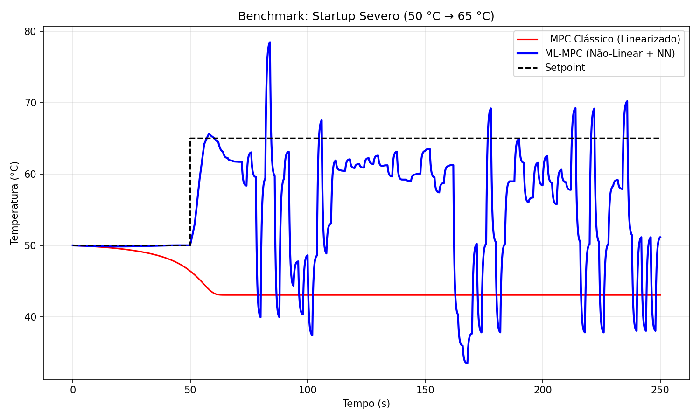
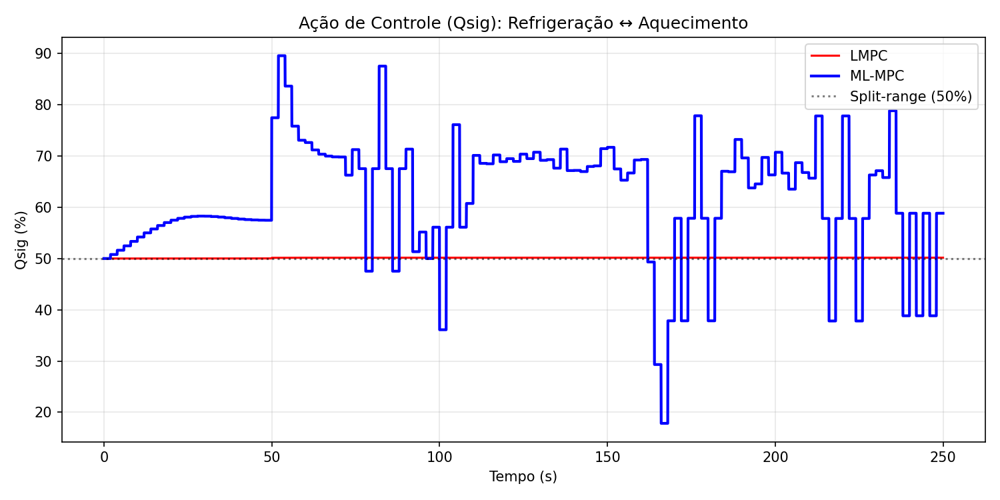
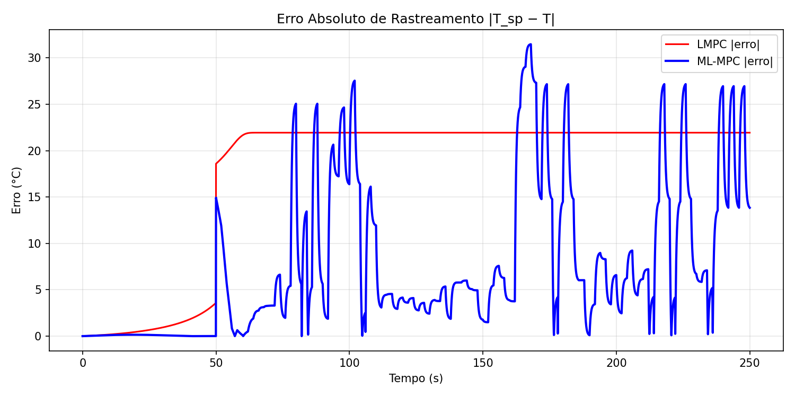

# Controle Avançado de Processos - ML-MPC
### Repositório referente a 2ª atividade avaliativa da disciplina de Controle Avançado de Processos 
Autores: Ian Ferreira e Maria Eduarda Cunha
---
## Introdução

O trabalho a seguir apresenta os resultados de simulação de uma estratégia de Controle Preditivo baseado em Modelo (MPC) aplicada a um reator químico contínuo de tanque agitado (CSTR) de etoxilação. Compara-se um controlador preditivo linear (LMPC), que emprega um modelo linearizado em torno de um ponto de operação fixo, contra um controlador híbrido ML-MPC, que combina os balanços fenomenológicos de massa e energia (gray-box) com um fator de correção cinética estimado por rede neural. O cenário de teste é um transitório de partida severo, com degrau de setpoint de 50 °C para 65 °C, região em que a não-linearidade de Arrhenius é acentuada.

O modelo de processo é um CSTR não-isotérmico com duas reações exotérmicas em série $$(A + B → C$$ e $$A + C → D)$$, descrito por balanços de massa por componente, balanço de energia e balanço de volume. A cinética segue a lei de Arrhenius, $$k = Ae^\frac{−E}{RT}$$, fonte da forte não-linearidade do sistema. A troca térmica é feita por uma jaqueta em configuração separação em 2 faixas: o sinal de controle $$Q_{sig}$$ (0 – 100 %) atua em refrigeração na faixa 0 – 50 % e em aquecimento na faixa 50 – 100 %.

## Formulação do Controle (do sistema de Benchmark)

### Controladores comparados

  -	LMPC (Linear MPC): usa as matrizes A e B obtidas por linearização numérica (Jacobiano por diferenças finitas) da dinâmica nominal em torno do ponto de operação (T = 50 °C, $$Q_{sig}$$ = 50 %). Prevê o futuro apenas por multiplicação matricial — rápido, porém impreciso longe do ponto de operação.

  -	ML-MPC (Híbrido): usa o preditor fenomenológico não-linear completo, integrado por Euler ao longo do horizonte, e aplica um fator de correção $$f_θ$$(T, Cₐ) da rede neural sobre a constante cinética k₁. Incorpora ainda soft constraints de segurança (limites de temperatura e volume) penalizando violações na função de custo.

Ambos resolvem o mesmo problema de controle ótimo (OCP) via L-BFGS-B com horizonte N = 12, pesos Q = 5.0 (rastreamento) e R = 0.5 (esforço/slew rate), warm-start da solução anterior e restrição de taxa ($$ΔU_{max}$$ = 20 %/passo) na ação aplicada. 

### Metodologia de Simulação
  -	Cenário: reator parte de 50 °C; em t = 50 s aplica-se o degrau de setpoint para 65 °C.
  -	Horizonte total: 250 s de processo; passo de integração dt = 0,05 s; lei de controle recalculada a cada 2 s.
  -	Métricas: MAE, RMSE e IAE do erro de rastreamento (avaliados após o degrau, t > 50 s), overshoot e tempo de acomodação a ±2 % do setpoint.

| Métrica | LMPC Linear | ML-MPC Híbrido | Melhor | Redução |
| :---: | :---: | :---: | :---: | :---: |
| MAE (°C) | 21.85 | 9.64 | ML-MPC | -55.9 % |
| RMSE (°C) | 21.85 | 12.66 | ML-MPC | -42.1 % |
| IAE | 4367.8 | 1927.2 | ML-MPC | -55.9 % |
| Overshoot (°C) | 0.00 | 13.45 | LMPC | - |
| Tempo acomodação (s) | Não acomoda | 5.8 | ML-MPC | - |

O ML-MPC reduz MAE e IAE em ~56 % e RMSE em 42.1 % em relação ao LMPC. O LMPC apresenta overshoot nulo apenas porque nunca atinge o setpoint — permanece próximo do ponto de linearização e não chega a acomodar dentro da tolerância de ±2 %. O ML-MPC atinge o setpoint rapidamente, ao custo de um sobressinal de aproximadamente 13 °C, mitigável por reajuste dos pesos Q/R ou das soft constraints.

### Rastreamento de Temperatura

Resposta de temperatura no transitório de partida (50 °C → 65 °C). O LMPC (em vermelho) estabiliza abaixo do setpoint. O ML-MPC (azul) conduz o reator ao alvo, no entanto, com bastante instabilidade.

### Ação de Controle 

Sinal de controle $$Q_{sig}$$ (%). O ML-MPC explora ativamente a faixa split-range (aquecimento acima de 50 %), enquanto o LMPC permanece praticamente estático em torno de 50 %.

### Erro absoluto de rastreamento

Evolução de |T_sp − T|. Após o degrau, o erro do LMPC permanece elevado e persistente, enquanto o do ML-MPC decai rapidamente.

Os resultados confirmam a hipótese central do projeto: em transitórios severos, onde a não-linearidade de Arrhenius domina, o modelo linear perde validade e o controlador linear torna-se incapaz de rastrear o setpoint. O ML-MPC, ao preservar a estrutura fenomenológica não-linear e corrigi-la com a rede neural, mantém desempenho superior de rastreamento em toda a faixa de operação.

O overshoot do ML-MPC indica espaço para sintonia: aumentar R (penalidade de esforço) ou reduzir a agressividade do horizonte suavizaria a resposta. O script tune_mpc.py do projeto, baseado em evolução diferencial, é o caminho natural para otimizar automaticamente Q e R.

---
| Left | Center | Right |
| :--- | :---: | ---: |
| Text | Text | Text |
